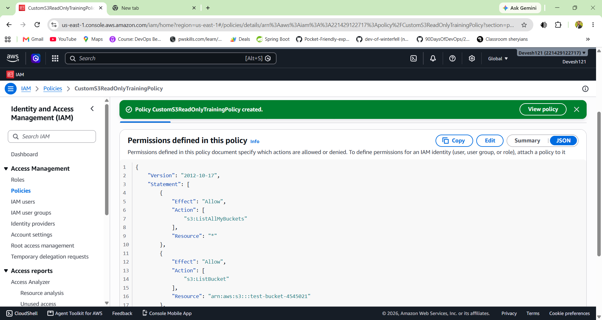
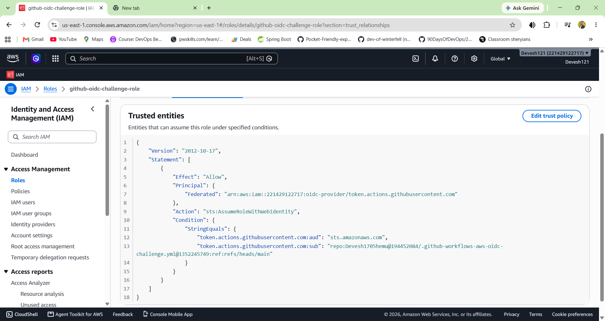
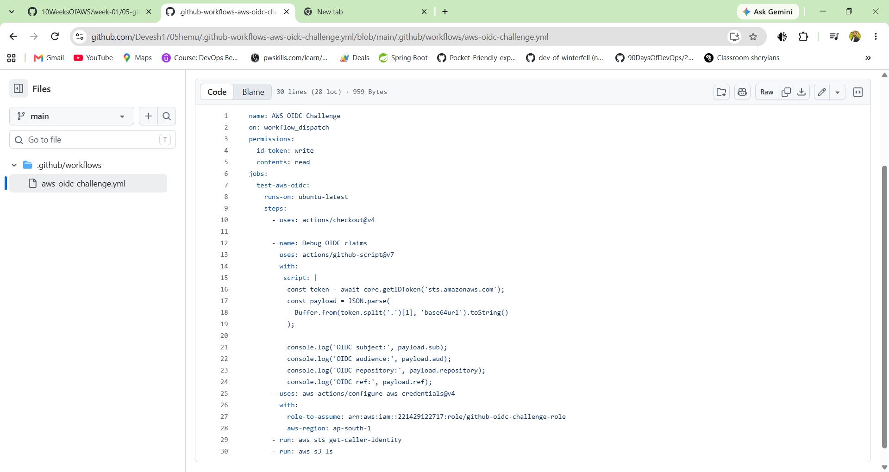

# Day 1

# 🔐 AWS Labs: Account Security & Billing

## Lab 1 - Secure Root User

### 🎯 Objective

Secure the AWS Root User by enabling **Multi-Factor Authentication (MFA)** and avoiding the Root User for daily AWS tasks.

---

### 🛠️ Steps

1. Create or log in to your AWS account.
2. Open the **AWS Management Console**.
3. Navigate to **IAM**.
4. Open the **Security credentials** or MFA settings for the Root User.
5. Enable **Multi-Factor Authentication (MFA)**.
6. Verify that MFA is successfully enabled.
7. Avoid using the Root User for daily AWS tasks.
8. Create an IAM user or role with appropriate permissions for regular work.

---

### 📸 Deliverable: Root MFA Enabled


### ✅ Result

MFA has been successfully enabled on the AWS Root User.

This adds an additional layer of security to the AWS account by requiring an authentication code along with the account credentials.

---

### 📝 Why the Root User Should Not Be Used Daily

The AWS Root User has **full access to the AWS account**. Using it for everyday tasks increases the risk of accidentally changing or deleting important resources.

For regular AWS work, it is safer to use an **IAM user or IAM role** with only the permissions required for the task.

### 🔐 Security Best Practices

* Enable MFA on the Root User.
* Do not use the Root User for everyday tasks.
* Do not share AWS account credentials.
* Use IAM users or roles for regular operations.
* Follow the principle of **least privilege**.
* Regularly review IAM permissions and security settings.

---

### 📚 What I Learned

Through this lab, I learned:

* Why securing the AWS Root User is important.
* How to enable MFA for the Root User.
* Why the Root User should not be used for daily operations.
* The importance of IAM users, roles, and least-privilege access.
* Basic AWS account security best practices.


# 💰 Lab 2 - Billing Alert

### 🎯 Objective

Set up an AWS budget to monitor cloud spending and receive an alert when the estimated cost reaches the defined threshold.

---

### 🛠️ Steps

1. Open the **AWS Management Console**.
2. Navigate to the **Billing and Cost Management Dashboard**.
3. Open **Budgets**.
4. Create a new **Cost Budget**.
5. Set the budget amount, for example **$5**.
6. Configure an alert notification for the budget.
7. Enter the email address where the billing alert should be received.
8. Confirm and create the budget.

---

### 📸 Deliverable: Billing Budget Alert

Add your screenshot below:


---

### ✅ Result

An AWS cost budget was created with a **$5 spending limit** and an alert configured to notify when the estimated AWS cost approaches or reaches the configured threshold.

---

### 📝 Why Billing Should Be Monitored from Day 1

AWS follows a **pay-as-you-go** pricing model, so even small configuration mistakes can result in unexpected charges.

Monitoring billing from the beginning helps to:

* Track AWS spending regularly.
* Detect unexpected resource usage.
* Avoid unnecessary cloud costs.
* Identify resources that are no longer needed.
* Understand how different AWS services affect the bill.
* Build good cloud cost-management habits.

For beginners, setting a small budget and enabling billing alerts is a simple way to learn AWS while reducing the risk of unexpected charges.

---

### 📚 What I Learned

Through this lab, I learned:

* How to access the AWS Billing Dashboard.
* How to create an AWS Cost Budget.
* How to configure billing alerts.
* Why monitoring cloud costs is important.
* How budgets can help control AWS spending.


# Day 2 - IAM Basics

## 🎯 Goal

Understand how AWS controls **who can access what**.

> **Identity + Permissions = Access**

---

## 🔐 IAM in Simple Words

Think of IAM like an **office ID card system**.

| IAM Component | Simple Meaning                              |
| ------------- | ------------------------------------------- |
| **User**      | A person or workload with an identity       |
| **Group**     | Collection of users with common permissions |
| **Role**      | Temporary access for a task                 |
| **Policy**    | Rules defining what is allowed or denied    |

---

## 👤 IAM User

An **IAM User** is a named identity for a person or workload.

Examples:

* `learner-s3` → S3 read-only access
* `learner-ec2` → EC2 read-only access
* `learner-billing` → Billing read-only access

### Important

Having a login does **not** mean having full AWS access.

> **Permissions decide what a user can do.**

---

## 👥 IAM Group

An **IAM Group** is a collection of users who need similar permissions.

Examples:

* `S3ReadOnlyGroup` → `AmazonS3ReadOnlyAccess`
* `EC2ReadOnlyGroup` → `AmazonEC2ReadOnlyAccess`
* `BillingViewGroup` → `AWSBillingReadOnlyAccess`

### Best Practice

Attach policies to **groups**, then add users to those groups.

This makes permission management easier.

---

## 🎭 IAM Role

An **IAM Role** provides temporary credentials to a trusted identity.

Common uses:

* AWS service accessing another AWS service
* GitHub Actions accessing AWS using OIDC
* A user switching to a role for temporary access

### Remember

> **Role = Temporary access**

For now, focus mainly on **Users and Groups**.

---

## 📜 IAM Policy

An **IAM Policy** is a JSON document that defines permissions.

It specifies what actions are:

* **Allowed**
* **Denied**

### Types of Policies

| Type                 | Meaning                           |
| -------------------- | --------------------------------- |
| **AWS Managed**      | Created and maintained by AWS     |
| **Customer Managed** | Created by you and reusable       |
| **Inline**           | Attached directly to one identity |

---

## 🔒 Least Privilege

**Least Privilege** means giving only the permissions required for a task.

Example:

If someone only needs to **view EC2 resources**, give:

> `EC2 ReadOnly`

Not:

> `EC2 Full Access`

### Remember

> **Give the minimum permissions required.**

---

## 🚧 Permission Boundary

A **Permission Boundary** defines the maximum permissions an IAM User or Role can have.

Important:

> A permission boundary **does not grant permissions**.

It only limits the maximum permissions that can be granted.

### Simple Example

If a boundary allows a maximum of:

> S3 Read + EC2 Read

The user cannot receive:

> S3 Delete

even if another policy tries to allow it.

### Remember

> **Permission Boundary = Maximum Permission Limit**

---

## 🧠 Quick Revision

```text
IAM
│
├── User       → Identity
├── Group      → Collection of users
├── Role       → Temporary access
├── Policy     → Permission rules
├── Least Privilege → Minimum required access
└── Permission Boundary → Maximum permission limit
```

### Key Points

* **User** = Who
* **Group** = Team
* **Role** = Temporary access
* **Policy** = Rules
* **Least Privilege** = Minimum required access
* **Permission Boundary** = Maximum limit

> **IAM controls who can access AWS resources and what they are allowed to do.**


# Day 3🔐 AWS Labs: Account Security & Billing

## Lab 1 - Secure Root User

### 🎯 Objective

Secure the AWS Root User by enabling **Multi-Factor Authentication (MFA)** and avoiding the Root User for daily AWS tasks.

---

### 🛠️ Steps

1. Create or log in to your AWS account.
2. Open the **AWS Management Console**.
3. Navigate to **IAM**.
4. Open the **Security credentials** or MFA settings for the Root User.
5. Enable **Multi-Factor Authentication (MFA)**.
6. Verify that MFA is successfully enabled.
7. Avoid using the Root User for daily AWS tasks.
8. Create an IAM user or role with appropriate permissions for regular work.

---

### 📸 Deliverable: Root MFA Enabled


### ✅ Result

MFA has been successfully enabled on the AWS Root User.

This adds an additional layer of security to the AWS account by requiring an authentication code along with the account credentials.

---

### 📝 Why the Root User Should Not Be Used Daily

The AWS Root User has **full access to the AWS account**. Using it for everyday tasks increases the risk of accidentally changing or deleting important resources.

For regular AWS work, it is safer to use an **IAM user or IAM role** with only the permissions required for the task.

### 🔐 Security Best Practices

* Enable MFA on the Root User.
* Do not use the Root User for everyday tasks.
* Do not share AWS account credentials.
* Use IAM users or roles for regular operations.
* Follow the principle of **least privilege**.
* Regularly review IAM permissions and security settings.

---

### 📚 What I Learned

Through this lab, I learned:

* Why securing the AWS Root User is important.
* How to enable MFA for the Root User.
* Why the Root User should not be used for daily operations.
* The importance of IAM users, roles, and least-privilege access.
* Basic AWS account security best practices.


# 💰 Lab 2 - Billing Alert

### 🎯 Objective

Set up an AWS budget to monitor cloud spending and receive an alert when the estimated cost reaches the defined threshold.

---

### 🛠️ Steps

1. Open the **AWS Management Console**.
2. Navigate to the **Billing and Cost Management Dashboard**.
3. Open **Budgets**.
4. Create a new **Cost Budget**.
5. Set the budget amount, for example **$5**.
6. Configure an alert notification for the budget.
7. Enter the email address where the billing alert should be received.
8. Confirm and create the budget.

---

### 📸 Deliverable: Billing Budget Alert

Add your screenshot below:


---

### ✅ Result

An AWS cost budget was created with a **$5 spending limit** and an alert configured to notify when the estimated AWS cost approaches or reaches the configured threshold.

---

### 📝 Why Billing Should Be Monitored from Day 1

AWS follows a **pay-as-you-go** pricing model, so even small configuration mistakes can result in unexpected charges.

Monitoring billing from the beginning helps to:

* Track AWS spending regularly.
* Detect unexpected resource usage.
* Avoid unnecessary cloud costs.
* Identify resources that are no longer needed.
* Understand how different AWS services affect the bill.
* Build good cloud cost-management habits.

For beginners, setting a small budget and enabling billing alerts is a simple way to learn AWS while reducing the risk of unexpected charges.

---

### 📚 What I Learned

Through this lab, I learned:

* How to access the AWS Billing Dashboard.
* How to create an AWS Cost Budget.
* How to configure billing alerts.
* Why monitoring cloud costs is important.
* How budgets can help control AWS spending.


# Day 4 - IAM Hands-On Lab

Today, practice **least privilege** using IAM users, groups, and policies.

Remember this:

> Identity + Permissions = Access

## IAM Practice Rule

Create only **read-only access** in this lab.

Practice in this order:

1. Create group.
2. Attach read-only policy to group.
3. Create user.
4. Add user to group.
5. Test allowed access.
6. Test denied access.

---

# Lab 1 - S3 Read-Only Access

### 🎯 Objective

Create an IAM user with read-only access to Amazon S3.

### Create

- Group: `S3ReadOnlyGroup`
- Policy: `AmazonS3ReadOnlyAccess`
- User: `learner-s3`

### 🛠️ Steps

1. Create the `S3ReadOnlyGroup`.
2. Attach `AmazonS3ReadOnlyAccess` to the group.
3. Create the `learner-s3` user.
4. Add `learner-s3` to `S3ReadOnlyGroup`.
5. Sign in as `learner-s3`.
6. Open Amazon S3.
7. Confirm the user can view S3 resources.
8. Try creating or deleting something.

### 📸 Deliverable

Capture:

- Group screenshot.
- User screenshot.
- Attached policy screenshot.
- Allowed S3 access screenshot.
- `Access Denied` screenshot for an unauthorized action.

#### Screenshots


### ✅ Result

The `learner-s3` user can view S3 resources but cannot perform unauthorized write or delete operations.

### 📚 What I Learned

- How to create an IAM group.
- How to attach a read-only AWS managed policy.
- How users inherit permissions from groups.
- How IAM denies unauthorized actions.
- Importance of least privilege.

---

# Lab 2 - EC2 Read-Only Access

### 🎯 Objective

Create an IAM user who can view EC2 resources but cannot create or terminate instances.

### Create

- Group: `EC2ReadOnlyGroup`
- Policy: `AmazonEC2ReadOnlyAccess`
- User: `learner-ec2`

### 🛠️ Steps

1. Create the `EC2ReadOnlyGroup`.
2. Attach `AmazonEC2ReadOnlyAccess` to the group.
3. Create the `learner-ec2` user.
4. Add `learner-ec2` to `EC2ReadOnlyGroup`.
5. Sign in as `learner-ec2`.
6. Open the EC2 Dashboard.
7. Confirm the user can view EC2 resources.
8. Try creating an EC2 instance.
9. Try terminating an EC2 instance.

### 📸 Deliverable

Capture:

- Group screenshot.
- User screenshot.
- Attached policy screenshot.
- EC2 Dashboard screenshot.
- Denied create/terminate action screenshot.

  #### Screenshots


### ✅ Result

The `learner-ec2` user can view EC2 resources but cannot create or terminate EC2 instances.

### 📚 What I Learned

- How to provide read-only EC2 access.
- How IAM policies control EC2 permissions.
- How read-only access prevents resource management.
- How to test allowed and denied actions.

---

# Lab 3 - Billing Read-Only Access

### 🎯 Objective

Create an IAM user who can view AWS billing information without unnecessary permissions.

### Create

- Group: `BillingViewGroup`
- Policy: `AWSBillingReadOnlyAccess`
- User: `learner-billing`

### 🛠️ Steps

1. Create the `BillingViewGroup`.
2. Attach `AWSBillingReadOnlyAccess` to the group.
3. Create the `learner-billing` user.
4. Add `learner-billing` to `BillingViewGroup`.
5. Sign in as `learner-billing`.
6. Open the Billing Dashboard.
7. Confirm the user can view billing information.
8. Try accessing or managing an unrelated AWS service.

### 📸 Deliverable

Capture:

- Group screenshot.
- User screenshot.
- Attached policy screenshot.
- Billing Dashboard screenshot.
- Access denied screenshot for an unauthorized action.


#### Screenshots


### ✅ Result

The `learner-billing` user can view billing information but does not have permission to manage unrelated AWS services.

### 📚 What I Learned

- How to provide billing read-only access.
- How IAM controls access to AWS services.
- How permissions can be limited to specific requirements.
- Importance of least privilege.

---

# Lab 4 - Custom S3 Read-Only Policy

### 🎯 Objective

Create a **customer managed IAM policy** that provides read-only access to a specific S3 bucket.

### Create

- Policy: `CustomS3ReadOnlyTrainingPolicy`
- Group: `S3ReadOnlyTrainingGroup`
- User: `learner-s3`
- Bucket: `test-bucket-4545021`

### 📜 Policy JSON

Replace `YOUR-BUCKET-NAME` with your actual bucket name.

```json
{
  "Version": "2012-10-17",
  "Statement": [
    {
      "Effect": "Allow",
      "Action": ["s3:ListAllMyBuckets"],
      "Resource": "*"
    },
    {
      "Effect": "Allow",
      "Action": ["s3:ListBucket"],
      "Resource": "arn:aws:s3:::YOUR-BUCKET-NAME"
    },
    {
      "Effect": "Allow",
      "Action": ["s3:GetObject"],
      "Resource": "arn:aws:s3:::YOUR-BUCKET-NAME/*"
    }
  ]
}
```

### 📸 Screenshot




# Day 5 - Optional GitHub OIDC Challenge

This challenge is optional. Try it only after completing the IAM User and IAM Group labs.

In this challenge, GitHub Actions will access AWS without storing long-lived AWS access keys.

Instead, GitHub Actions will use an OIDC token to request temporary AWS credentials through AWS STS.

---

## Architecture

GitHub Actions -> OIDC Token -> AWS IAM OIDC Provider -> AWS STS -> Temporary AWS Credentials -> AWS Resources

### Architecture Screenshot

<!-- Add architecture screenshot here -->


---

## Step 1 - Add OIDC Provider

Open:

`AWS Console -> IAM -> Identity Providers -> Add Provider`

Use:

| Setting | Value |
|---|---|
| Provider type | `OpenID Connect` |
| Provider URL | `https://token.actions.githubusercontent.com` |
| Audience | `sts.amazonaws.com` |

The OIDC provider allows AWS to trust identity tokens issued by GitHub Actions.

### OIDC Provider Screenshot

<!-- Add screenshot here -->


---

## Step 2 - Create IAM Role

Create an IAM role with the following configuration:

| Setting | Value |
|---|---|
| Trusted entity | `Web Identity` |
| Provider | `token.actions.githubusercontent.com` |
| Audience | `sts.amazonaws.com` |
| Permission | `AmazonS3ReadOnlyAccess` |
| Example role name | `github-oidc-challenge-role` |

The IAM role allows GitHub Actions to access AWS resources using temporary credentials.

### IAM Role Screenshot

<!-- Add screenshot here -->


---

## Step 3 - Trust Policy

The IAM role needs a trust policy that allows GitHub Actions to assume the role.

Replace these placeholders before using the policy:

- `<AWS_ACCOUNT_ID>` with your AWS account ID
- `<GITHUB_USER>` with your GitHub username
- `<REPOSITORY>` with your repository name

```json
{
  "Version": "2012-10-17",
  "Statement": [
    {
      "Effect": "Allow",
      "Principal": {
        "Federated": "arn:aws:iam::<AWS_ACCOUNT_ID>:oidc-provider/token.actions.githubusercontent.com"
      },
      "Action": "sts:AssumeRoleWithWebIdentity",
      "Condition": {
        "StringEquals": {
          "token.actions.githubusercontent.com:aud": "sts.amazonaws.com"
        },
        "StringLike": {
          "token.actions.githubusercontent.com:sub": "repo:<GITHUB_USER>/<REPOSITORY>:*"
        }
      }
    }
  ]
}
```
###  Trust Policy



## Step 4 - Create GitHub Actions Workflow

Create the following file in your GitHub repository:

`.github/workflows/aws-oidc-challenge.yml`

Use the following workflow:

```yaml
name: AWS OIDC Challenge

on:
  workflow_dispatch:

permissions:
  id-token: write
  contents: read

jobs:
  test-aws-oidc:
    runs-on: ubuntu-latest

    steps:
      - uses: actions/checkout@v4

      - uses: aws-actions/configure-aws-credentials@v4
        with:
          role-to-assume: arn:aws:iam::<AWS_ACCOUNT_ID>:role/<ROLE_NAME>
          aws-region: ap-south-1

      - run: aws sts get-caller-identity

      - run: aws s3 ls
```
### GitHub Actions Workflow




## Step 5 - Run the GitHub Actions Workflow

Go to:

`GitHub Repository -> Actions -> AWS OIDC Challenge`

###  Successful GitHub Actions Run


