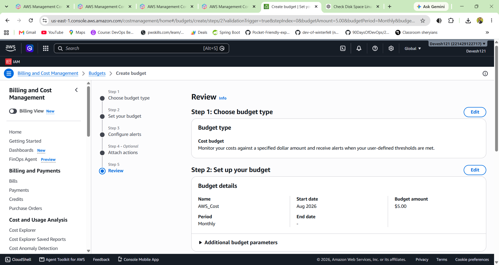

# 🔐 AWS Labs: Account Security & Billing

## Lab 1 - Secure Root User

### 🎯 Objective

Secure the AWS Root User by enabling **Multi-Factor Authentication (MFA)** and avoiding the Root User for daily AWS tasks.

---

### 🛠️ Steps

1. Create or log in to your AWS account.
2. Open the **AWS Management Console**.
3. Navigate to **IAM**.
4. Open the **Security credentials** or MFA settings for the Root User.
5. Enable **Multi-Factor Authentication (MFA)**.
6. Verify that MFA is successfully enabled.
7. Avoid using the Root User for daily AWS tasks.
8. Create an IAM user or role with appropriate permissions for regular work.

---

### 📸 Deliverable: Root MFA Enabled

### ✅ Result

MFA has been successfully enabled on the AWS Root User.

This adds an additional layer of security to the AWS account by requiring an authentication code along with the account credentials.

---

### 📝 Why the Root User Should Not Be Used Daily

The AWS Root User has **full access to the AWS account**. Using it for everyday tasks increases the risk of accidentally changing or deleting important resources.

For regular AWS work, it is safer to use an **IAM user or IAM role** with only the permissions required for the task.

### 🔐 Security Best Practices

* Enable MFA on the Root User.
* Do not use the Root User for everyday tasks.
* Do not share AWS account credentials.
* Use IAM users or roles for regular operations.
* Follow the principle of **least privilege**.
* Regularly review IAM permissions and security settings.

---

### 📚 What I Learned

Through this lab, I learned:

* Why securing the AWS Root User is important.
* How to enable MFA for the Root User.
* Why the Root User should not be used for daily operations.
* The importance of IAM users, roles, and least-privilege access.
* Basic AWS account security best practices.

# 💰 Lab 2 - Billing Alert

### 🎯 Objective

Set up an AWS budget to monitor cloud spending and receive an alert when the estimated cost reaches the defined threshold.

---

### 🛠️ Steps

1. Open the **AWS Management Console**.
2. Navigate to the **Billing and Cost Management Dashboard**.
3. Open **Budgets**.
4. Create a new **Cost Budget**.
5. Set the budget amount, for example **$5**.
6. Configure an alert notification for the budget.
7. Enter the email address where the billing alert should be received.
8. Confirm and create the budget.

---

### 📸 Deliverable: Billing Budget Alert

Add your screenshot below:

---

### ✅ Result

An AWS cost budget was created with a **$5 spending limit** and an alert configured to notify when the estimated AWS cost approaches or reaches the configured threshold.

---

### 📝 Why Billing Should Be Monitored from Day 1

AWS follows a **pay-as-you-go** pricing model, so even small configuration mistakes can result in unexpected charges.

Monitoring billing from the beginning helps to:

* Track AWS spending regularly.
* Detect unexpected resource usage.
* Avoid unnecessary cloud costs.
* Identify resources that are no longer needed.
* Understand how different AWS services affect the bill.
* Build good cloud cost-management habits.

For beginners, setting a small budget and enabling billing alerts is a simple way to learn AWS while reducing the risk of unexpected charges.

---

### 📚 What I Learned

Through this lab, I learned:

* How to access the AWS Billing Dashboard.
* How to create an AWS Cost Budget.
* How to configure billing alerts.
* Why monitoring cloud costs is important.
* How budgets can help control AWS spending.

