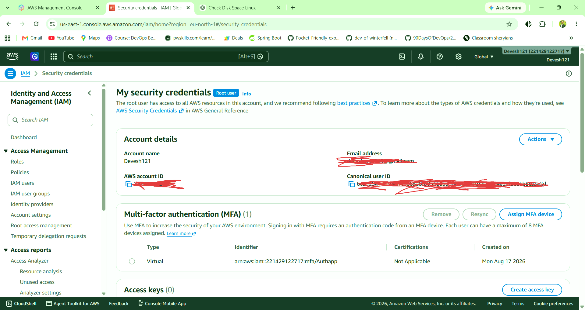

# 🔐 AWS Labs: Account Security & Billing

## Lab 1 - Secure Root User

### 🎯 Objective

Secure the AWS Root User by enabling **Multi-Factor Authentication (MFA)** and avoiding the Root User for daily AWS tasks.

### 🛠️ Steps

1. Create or log in to your AWS account.
2. Search for `IAM` in the AWS Console.
3. Open the security recommendations or MFA settings.
4. Enable MFA on the Root User.
5. Stop using the Root User for daily work.
6. Create an IAM admin user only if needed for regular work.

### 📦 Deliverables

#### 📸 Screenshot of Root MFA Enabled


<!-- CONTRIBUTING -->
```text


**Result:** MFA has been successfully enabled on the AWS Root User. This adds an extra layer of security to the AWS account.

### 📝 Why Root User should not be used daily

The Root User has full access to the AWS account. Using it daily can increase the risk of accidentally changing or deleting resources.

For daily work, it is safer to use an IAM user or role with only the required permissions.


