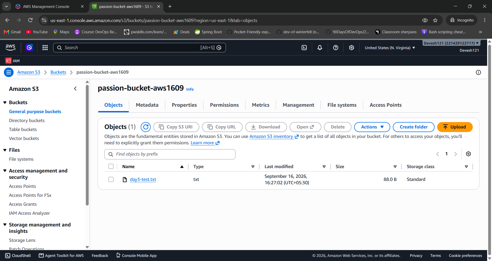
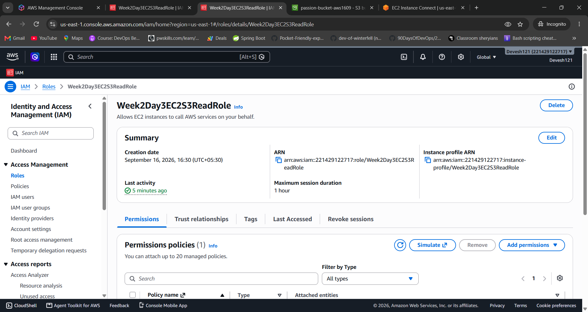
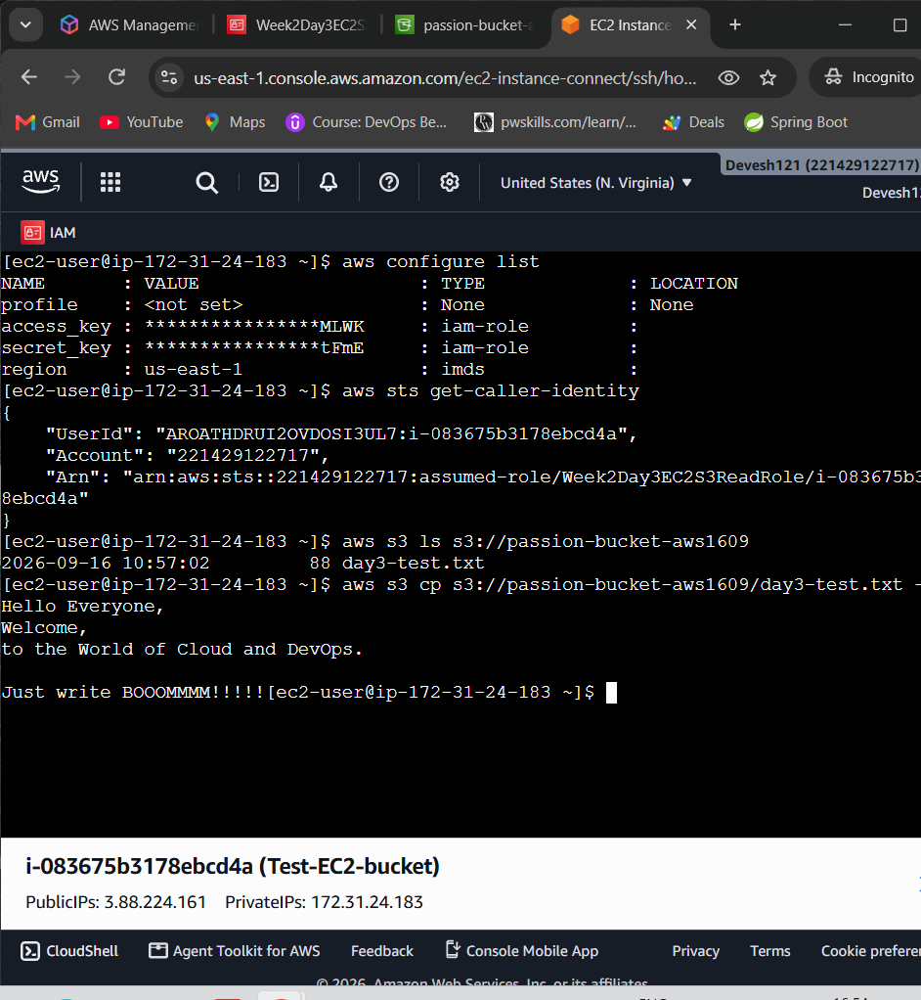
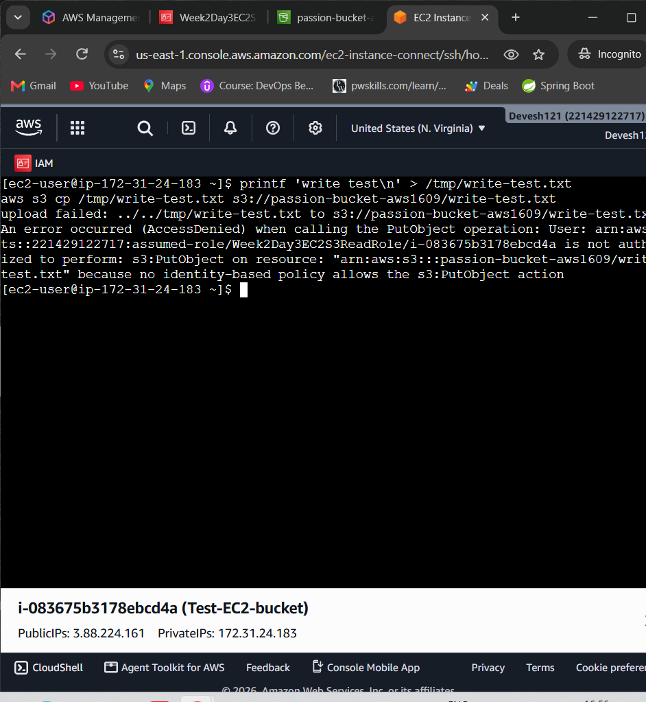

# Day 3 - IAM Roles, STS, and Temporary Credentials

**Goal:** Understand how an AWS service or workload gets temporary access to
another AWS service without storing permanent credentials.

---

## 

### 1. Why should an application avoid storing access keys?

- Access keys can be stolen.
- They provide direct AWS access.
- Managing permanent keys is difficult.
- Temporary credentials are safer.

### 2. Who is allowed to assume a role?

- AWS services like EC2 or Lambda.
- IAM users or roles.
- Users or roles from another AWS account.
- Federated identities, if trusted.

### 3. What is the role allowed to do after it is assumed?

- Access AWS resources allowed by its permissions.
- Perform specific AWS actions.
- Use temporary credentials.
- It can only perform allowed actions.

### 4. Why do temporary credentials expire?

- To improve security.
- To reduce the impact of stolen credentials.
- To limit how long access is available.
- New credentials can be obtained when required.

---

# IAM Role

An **IAM Role** is an AWS identity with permissions. It is not permanently
connected to one person.

A trusted principal assumes the role and receives temporary credentials.

A principal can be:

- An AWS service such as EC2 or Lambda
- An IAM user or role in the same account
- A principal in another AWS account
- A federated identity

---

# Trust Policy vs Permission Policy

Both policies are needed, but they answer different questions.

| Policy | Main Question | Purpose |
|---|---|---|
| Trust Policy | Who can assume this role? | Defines trusted principals |
| Permission Policy | What can the role do? | Defines allowed actions and resources |

## Trust Policy

An EC2 trust policy looks like this:

```json
{
  "Version": "2012-10-17",
  "Statement": [
    {
      "Effect": "Allow",
      "Principal": {
        "Service": "ec2.amazonaws.com"
      },
      "Action": "sts:AssumeRole"
    }
  ]
}
````

This policy:

* Trusts the EC2 service.
* Allows EC2 to assume the role.
* Does not grant S3 access.
* S3 permissions must be provided separately.

## Permission Policy

A permission policy can grant S3 access:

```json
{
  "Version": "2012-10-17",
  "Statement": [
    {
      "Effect": "Allow",
      "Action": ["s3:ListBucket"],
      "Resource": "arn:aws:s3:::YOUR-BUCKET-NAME"
    },
    {
      "Effect": "Allow",
      "Action": ["s3:GetObject"],
      "Resource": "arn:aws:s3:::YOUR-BUCKET-NAME/*"
    }
  ]
}
```

This policy allows the role to:

* List the S3 bucket.
* Read objects from S3.
* Access only the specified bucket.
* Perform only the allowed actions.

---

# STS AssumeRole Mechanism

**AWS Security Token Service (STS)** creates temporary credentials for a role
session.

## Simplified Flow

1. A principal requests to assume a role.
2. AWS checks the trust policy.
3. AWS checks other applicable permissions and controls.
4. STS creates a temporary session.
5. The workload uses the temporary credentials.
6. The credentials expire and are refreshed when required.

## Temporary Credentials

STS can provide:

* Access Key ID
* Secret Access Key
* Session Token
* Expiration time

Temporary credentials are safer than long-lived IAM user access keys because
they expire after a limited time.

---

# Instance Profiles and EC2 Roles

An **IAM Role** contains the trust relationship and permissions.

An **Instance Profile** makes an IAM role available to an EC2 instance.

AWS commonly creates the instance profile when an EC2 role is created through
the AWS Console.

The AWS CLI and SDKs can automatically:

* Get temporary credentials.
* Use the credentials.
* Refresh the credentials when required.

## Do Not Store Permanent Access Keys In

* User data
* Environment files
* Application source code
* AMIs
* Shell history

---

# Cross-Service Role Assumption

Cross-service role assumption happens when one AWS service uses a role to
access another AWS service.

## Examples

* EC2 reads an object from S3.
* Lambda writes logs to CloudWatch Logs.
* Step Functions invokes Lambda.
* ECS tasks read secrets from Secrets Manager.

The role has:

* **Trust Policy** → Defines who can assume the role.
* **Permission Policy** → Defines what the role can do.

---

# Key Line

> **Trust policy answers WHO. Permission policy answers WHAT. STS supplies
> short-lived credentials. The instance profile delivers the role to EC2.**

---

# Based on your Understanding

### 1. Does an EC2 trust policy grant permission to read an S3 object?

**No.**

* Trust policy only decides who can assume the role.
* It does not grant S3 permissions.
* S3 permissions are provided by the permission policy.
* `s3:GetObject` can allow reading S3 objects.

### 2. What must change if Lambda needs to assume the role?

* Change the trusted principal from EC2 to Lambda.
* Use `lambda.amazonaws.com`.
* Keep the required permission policy.
* Lambda can then assume the role.

### 3. Why is an instance role safer than storing IAM user keys on EC2?

* Permanent keys do not need to be stored.
* Credentials are temporary.
* AWS provides credentials to the EC2 instance.
* Credentials are automatically refreshed.

### 4. What should happen when temporary credentials expire?

* Expired credentials cannot be used.
* AWS CLI/SDK can obtain fresh credentials.
* The application should use the refreshed credentials.
* Permanent access keys should not be stored.

---

# Key Takeaways

* **IAM Role** → Provides temporary AWS permissions.
* **Trust Policy** → Defines **WHO** can assume the role.
* **Permission Policy** → Defines **WHAT** the role can do.
* **STS** → Provides temporary credentials.
* **Instance Profile** → Connects a role to EC2.
* **Temporary Credentials** → Expire and can be refreshed.


# Day 3 Practical - EC2 Reads S3 Using an IAM Role

## 🎯 Goal

Allow an **EC2 instance to read one S3 bucket** without storing permanent
access keys.

**Read = Allowed ✅**  
**Write/Delete = Denied ❌**

---

## Architecture

```text
EC2
 ↓
Instance Profile
 ↓
IAM Role
 ↓
STS Temporary Credentials
 ↓
S3 Bucket
 ↓
Read/List ✅
Write/Delete ❌
````

📸 **Screenshot: Architecture**

> Add screenshot here.

<br><br>

---

## Cost & Safety

* Use a small Free Tier eligible EC2 instance when available.
* Use a test S3 bucket.
* Do not create IAM user access keys.
* Never share temporary credentials.
* Delete resources after completing the lab.

---

## Step 1 - Create Test S3 Bucket

* Create a unique S3 bucket.
* Keep **Block Public Access** enabled.
* Upload `day3-test.txt`.
* Add a simple non-sensitive message.
* Save the bucket name.

📸 **Screenshot: S3 Bucket**



<br><br>

---

## Step 2 - Create EC2 IAM Role

Go to:

**IAM → Roles → Create Role**

* Trusted entity: **AWS Service**
* Use case: **EC2**
* Role name: `Week2Day3EC2S3ReadRole`
* Do not attach broad S3 permissions.
* Trust policy should allow `ec2.amazonaws.com` to assume the role.

📸 **Screenshot: IAM Role**



<br><br>

---

## Step 3 - Add Least-Privilege S3 Permissions

Create an inline policy named:

`ReadOneTrainingBucket`

```json
{
  "Version": "2012-10-17",
  "Statement": [
    {
      "Sid": "ListOneBucket",
      "Effect": "Allow",
      "Action": "s3:ListBucket",
      "Resource": "arn:aws:s3:::YOUR-BUCKET-NAME"
    },
    {
      "Sid": "ReadObjectsInOneBucket",
      "Effect": "Allow",
      "Action": "s3:GetObject",
      "Resource": "arn:aws:s3:::YOUR-BUCKET-NAME/*"
    }
  ]
}
```

### Important

The policy does **not** include:

* `s3:PutObject`
* `s3:DeleteObject`
* Broad `s3:*` permissions

📸 **Screenshot: Permission Policy**


<br><br>

---

## Step 4 - Attach Role to EC2

* Launch a small Amazon Linux EC2 instance.
* Select `Week2Day3EC2S3ReadRole` as the IAM instance profile.
* Connect using EC2 Instance Connect or Session Manager.
* Wait for the instance checks to pass.

If EC2 already exists:

**Actions → Security → Modify IAM Role**

📸 **Screenshot: EC2 IAM Role**

> Add screenshot here.

<br><br>

---

## Step 5 - Test Allowed Access

First check that no credentials were manually configured:

```bash
aws configure list
```

Then test:

```bash
aws sts get-caller-identity
aws s3 ls s3://YOUR-BUCKET-NAME
aws s3 cp s3://YOUR-BUCKET-NAME/day3-test.txt -
```

### Expected Result

* Caller identity shows an **assumed role**.
* S3 bucket listing works.
* Test file can be read.

📸 **Screenshot: Successful S3 Access**



<br><br>

---

## Step 6 - Test Denied Access

Create a test file:

```bash
printf 'write test\n' > /tmp/write-test.txt
```

Try uploading it:

```bash
aws s3 cp /tmp/write-test.txt s3://YOUR-BUCKET-NAME/write-test.txt
```

### Expected Result

```text
AccessDenied
```

This proves that **least privilege is working**.

📸 **Screenshot: Access Denied**


<br><br>

---

### ⚠️ Never Share

* Access Key ID
* Secret Access Key
* Session Token
* Private Key
* Sensitive account information
* Private data

---

# Key Takeaways

* **EC2 → IAM Role → STS → Temporary Credentials → S3**
* IAM Role avoids storing permanent access keys.
* `s3:ListBucket` allows bucket listing.
* `s3:GetObject` allows reading objects.
* No `PutObject` means uploading is denied.
* **AccessDenied is expected and proves least privilege.**


